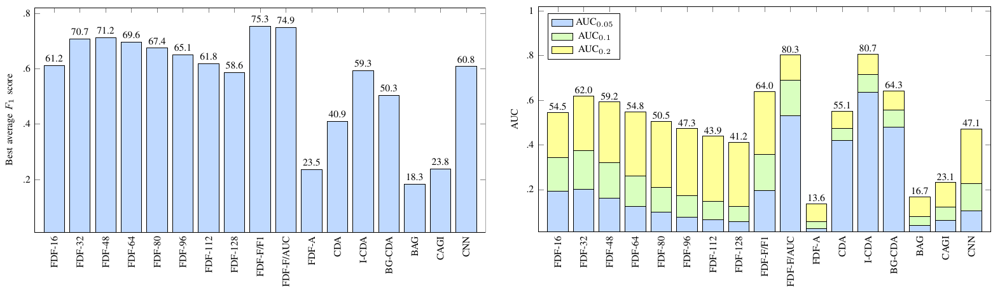
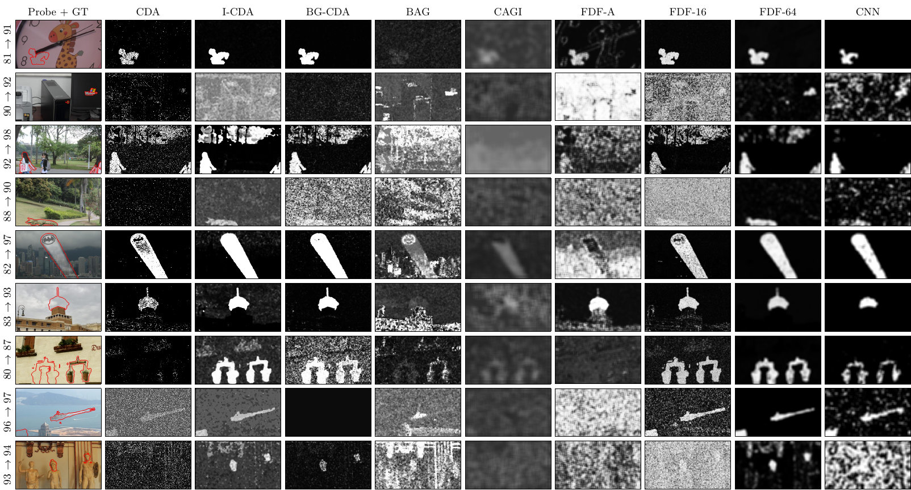

# JPEG Forgery Detection and Localization with Mode-based First Digit Features

This package implements a multi-scale JPEG forgery detector based on mode-based first digit features and SVM classification [1]. The detector delivers competitive performance compared to state-of-the-art alternatives. The figure below shows comparison of the F1 and AUC scores in a large-scale evaluation (4,620 images representing 220 realistic forgery cases with various JPEG compression settings). 

The included detector is denoted as `FDF-<window-size>`, depending on the size of the analysis window. The performance can be further improved by using multi-scale fusion (see `FDF-F/*` in the figure and [1] for details). Implementation of multi-scale fusion methods can be found in a [separate repository](https://github.com/pkorus/multiscale-prnu) (see [2] for more details). 



A qualitative comparison with state-of-the-art detectors on realistic forgery examples with various compression settings is shown below. For more information, please see a comprehensive evaluation in [3] 



## License

This code is intended only for research and educational purposes. No warranty or support of any kind are provided whatsoever. If you find any bugs or some new ways to improve the techniques, let me know. If you use this code in your research, please cite the corresponding papers (see Bibtex definition below):

```
@article{Korus2016TIP,
	Author = {P. Korus and J. Huang},
	Journal = {IEEE Trans. on Image Processing},
	Title = {Multi-Scale Fusion for Improved Localization of Malicious Tampering in Digital Images},
	year={2016},
  volume={25},
	number={3},
	pages={1312-1326},
	doi={10.1109/TIP.2016.2518870},
	ISSN={1057-7149}
}
```

## Usage

Use `setup` to automatically add dependencies to the Matlab's path. Then, run `main` to process sample images (see code for usage example). [LibSVM](https://github.com/cjlin1/libsvm) is needed for SVM classification. 

## Machine Learning Models

The detector uses SVM detection models pre-trained on the UCID dataset (1,338 color, uncompressed images, see [1] for training details). The models can be trained for specific JPEG quality levels (*quality-aware* training), or for a generic case (*quality-oblivious* training). The former case leads to better performance, but requires multiple models - for each supported quality level. See [3] for more information about the expected difference in performance between the two cases. 

To limit repository size, this package includes pre-trained models for the *quality-oblivious* case only. Three window sizes are included: 32x32, 64x64 and 128x128 px. A full set of SVM models for 8 analysis windows and quality levels: 50, 51, ..., 100 can be downloaded from [here](http://kt.agh.edu.pl/~korus/files/mbfdf_pretrained_svm_models_20_modes_mat.tar.gz) (1.4 GB).

## References

1. P. Korus and J. Huang, [Multi-Scale Fusion for Improved Localization of Malicious Tampering in Digital Images](http://dx.doi/10.1109/TIP.2016.2518870), IEEE Transactions on Image Processing, Vol. 25, Issue 3, 2016
2. P. Korus and J. Huang, [Multi-scale Analysis Strategies in PRNU-based Tampering Localization](http://dx.doi.org/10.1109/TIFS.2016.2636089), IEEE Transactions on Information Forensics and Security, Vol. 12, Issue 4 , 2017
3. P. Korus, [Large-Scale and Fine-Grained Evaluation of Popular JPEG Forgery Localization Scheme](https://arxiv.org/abs/1811.12915), arXiv:1811.12915, 2018
